**Related:** [[Isandar_Quickclaw]] · [[Skill_Tree_System]]

```mermaid
graph TD
    ROOT["ISANDAR QUICKCLAW<br/>Skill Development"]
    ROOT --> STATUS["Status: Post-Transformation<br/>Day 2 Recovery"]
    STATUS --> NOTE["Date: Session 06 End<br/>Current Location: Garrison Barracks"]
    
    ROOT --> BODY["BODY"]
    ROOT --> MIND["MIND"]
    ROOT --> SOCIAL["SOCIAL"]
    ROOT --> CRAFT["CRAFT"]
    ROOT --> EDGE["EDGE"]
    ROOT --> ESSENCE["ESSENCE"]
    
    BODY --> B_T1["T1: Root<br/>Combat Form I<br/>(patrol experience)"]
    B_T1 --> B_T2["T2: Emerging<br/>2/3 marks<br/>Early hound form<br/>learning"]
    
    MIND --> M_T1["T1: Root<br/>Knowledge I<br/>(self-taught reader)<br/>Perception I<br/>(dock-trained observer)"]
    M_T1 --> M_T2A["T2: Emerging - Knowledge<br/>2/3 marks<br/>logistics & procedure"]
    M_T1 --> M_T2B["T2: Emerging - Perception<br/>2/3 marks<br/>enhanced scent reading<br/>New capability!"]
    
    SOCIAL --> S_T1["T1: Root<br/>Connection I<br/>(forming squad bonds)"]
    S_T1 --> S_T2["T2: Emerging<br/>1/3 marks<br/>Colette, Cault,<br/>Dix relationships"]
    
    CRAFT --> C_T1["T1: Root<br/>Systems I<br/>(garrison procedure)"]
    C_T1 --> C_T2["T2: Not Yet"]
    
    EDGE --> E_T1["T1: Root<br/>Cunning I<br/>(pragmatic problem-solving)<br/>Survival I<br/>(physical & social resilience)"]
    E_T1 --> E_T2A["T2: Emerging - Cunning<br/>2/3 marks<br/>tactical decisions"]
    E_T1 --> E_T2B["T2: Emerging - Survival<br/>1/3 marks<br/>transformation endurance"]
    
    ESSENCE --> ESS_INIT["INITIALIZED<br/>Hound Transformation"]
    ESS_INIT --> ESS_B["Body Integration Branch<br/>T1: Hound Form I<br/>(2/3 marks)<br/>Learning hound movement,<br/>tail control, instinct management"]
    ESS_INIT --> ESS_S["Sense Attunement Branch<br/>T1: Enhanced Scent I<br/>(2/3 marks)<br/>Reading through walls,<br/>layered smell identification"]
    
    style ROOT fill:#6a6aff,color:#fff
    style STATUS fill:#a0a0ff,color:#fff
    style NOTE fill:#909090,color:#fff
    style BODY fill:#ffcccc
    style MIND fill:#b3ebe4
    style SOCIAL fill:#ffe6a8
    style CRAFT fill:#c3f7c7
    style EDGE fill:#f0c9ff
    style ESSENCE fill:#ffdbcc,color:#222
    
    style B_T1 fill:#ffeeee
    style B_T2 fill:#ffe6e6
    
    style M_T1 fill:#e8faf7
    style M_T2A fill:#dff5f1
    style M_T2B fill:#dff5f1
    
    style S_T1 fill:#fff8e6
    style S_T2 fill:#fff0cc
    
    style C_T1 fill:#f0fce6
    style C_T2 fill:#e8f9dd
    
    style E_T1 fill:#f9e6ff
    style E_T2A fill:#f3d9ff
    style E_T2B fill:#f3d9ff
    
    style ESS_INIT fill:#ffeedd,color:#222
    style ESS_B fill:#ffddb3,color:#222
    style ESS_S fill:#ffd9a3,color:#222
```

---

**Current State (Session 06 End)**

- **Transformation:** Complete — hound form, female, olive-bronze
- **Recovery:** Day 2 of ~7
- **Location:** Garrison barracks
- **Most Advanced Node:** Perception T2 (enhanced scent reading) — emerging with 2/3 marks
- **ESSENCE Status:** Both branches (Body Integration, Sense Attunement) at T1 with active marks accumulating
- **Next Gates:** 
  - Body Integration minor gate likely at first independent field patrol
  - Sense Attunement minor gate could come from first real operational use
  - Social/Connection → T3 when squad bonding deepens beyond current formation phase

---

*Updated: Session 06 end checkpoint*
