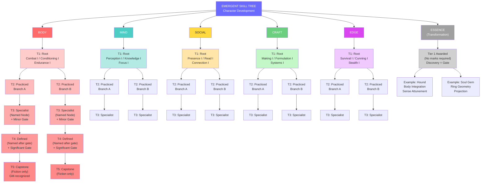

**Related:** [[Skill_Trees]] for complete system documentation

```mermaid
graph TD
    ROOT["EMERGENT SKILL TREE<br/>Character Development"]
    
    ROOT --> BODY["BODY"]
    ROOT --> MIND["MIND"]
    ROOT --> SOCIAL["SOCIAL"]
    ROOT --> CRAFT["CRAFT"]
    ROOT --> EDGE["EDGE"]
    ROOT --> ESSENCE["ESSENCE<br/>(Transformation)"]
    
    BODY --> B_T1["T1: Root<br/>Combat I / Conditioning I<br/>Endurance I"]
    B_T1 --> B_T2A["T2: Practiced<br/>Branch A"]
    B_T1 --> B_T2B["T2: Practiced<br/>Branch B"]
    
    B_T2A --> B_T3A["T3: Specialist<br/>(Named Node)<br/>+ Minor Gate"]
    B_T2B --> B_T3B["T3: Specialist<br/>(Named Node)<br/>+ Minor Gate"]
    
    B_T3A --> B_T4A["T4: Defined<br/>(Named after gate)<br/>+ Significant Gate"]
    B_T3B --> B_T4B["T4: Defined<br/>(Named after gate)<br/>+ Significant Gate"]
    
    B_T4A --> B_T5A["T5: Capstone<br/>(Fiction only)<br/>GM-recognized"]
    B_T4B --> B_T5B["T5: Capstone<br/>(Fiction only)"]
    
    MIND --> M_T1["T1: Root<br/>Perception I / Knowledge I<br/>Focus I"]
    M_T1 --> M_T2A["T2: Practiced<br/>Branch A"]
    M_T1 --> M_T2B["T2: Practiced<br/>Branch B"]
    M_T2A --> M_T3A["T3: Specialist"]
    M_T2B --> M_T3B["T3: Specialist"]
    
    SOCIAL --> S_T1["T1: Root<br/>Presence I / Read I<br/>Connection I"]
    S_T1 --> S_T2A["T2: Practiced<br/>Branch A"]
    S_T1 --> S_T2B["T2: Practiced<br/>Branch B"]
    S_T2A --> S_T3A["T3: Specialist"]
    S_T2B --> S_T3B["T3: Specialist"]
    
    CRAFT --> C_T1["T1: Root<br/>Making I / Formulation I<br/>Systems I"]
    C_T1 --> C_T2A["T2: Practiced<br/>Branch A"]
    C_T1 --> C_T2B["T2: Practiced<br/>Branch B"]
    C_T2A --> C_T3A["T3: Specialist"]
    C_T2B --> C_T3B["T3: Specialist"]
    
    EDGE --> E_T1["T1: Root<br/>Survival I / Cunning I<br/>Stealth I"]
    E_T1 --> E_T2A["T2: Practiced<br/>Branch A"]
    E_T1 --> E_T2B["T2: Practiced<br/>Branch B"]
    E_T2A --> E_T3A["T3: Specialist"]
    E_T2B --> E_T3B["T3: Specialist"]
    
    ESSENCE --> ESS_INIT["Tier 1 Awarded<br/>(No marks required)<br/>Discovery = Gate"]
    ESS_INIT --> ESS_EX1["Example: Hound<br/>Body Integration<br/>Sense Attunement"]
    ESS_INIT --> ESS_EX2["Example: Soul Gem<br/>Ring Geometry<br/>Projection"]
    
    style ROOT fill:#6a6aff,color:#fff
    style BODY fill:#ff6b6b,color:#fff
    style MIND fill:#4ecdc4,color:#fff
    style SOCIAL fill:#ffd93d,color:#222
    style CRAFT fill:#6bcf7f,color:#fff
    style EDGE fill:#d946ef,color:#fff
    style ESSENCE fill:#a0a0a0,color:#fff
    
    style B_T1 fill:#ffcccc
    style B_T2A fill:#ffbbbb
    style B_T2B fill:#ffbbbb
    style B_T3A fill:#ffaaaa
    style B_T3B fill:#ffaaaa
    style B_T4A fill:#ff9999
    style B_T4B fill:#ff9999
    style B_T5A fill:#ff8888
    style B_T5B fill:#ff8888
    
    style M_T1 fill:#b3ebe4
    style S_T1 fill:#ffe6a8
    style C_T1 fill:#c3f7c7
    style E_T1 fill:#f0c9ff
    style ESS_INIT fill:#d0d0d0
```
